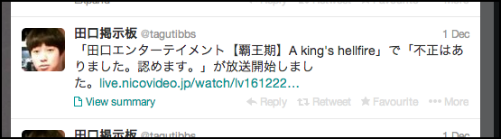

nicoalert
=============
niconama alert for twitter

sample
-------------


required library
-------------
````
$ sudo apt-get install libxml2-dev
$ sudo apt-get install libxslt1-dev
````

setup
-------------
````
$ git submodule update --init
$ virtualenv --distribute venv
$ source ./venv/bin/activate
$ pip install http://sourceforge.net/projects/pychecker/files/pychecker/0.8.19/pychecker-0.8.19.tar.gz/download
$ pip install -r requirements.txt
$ cp nicoalert.config.sample nicoalert.config
$ vi nicoalert.config
````

kick
-------------
start.
````
$ ./nicoalert.sh start
````
stop.
````
$ ./nicoalert.sh stop
````

monitoring example using crontab
-------------

	# monitoring nicoalert
	* * * * * /path/to/nicoalert/nicoalert.sh monitor >> /path/to/nicoalert/log/monitor.log 2>&1

license
-------------

copyright &copy; 2012- honishi, hiroyuki onishi.

distributed under the [MIT license][mit].
[mit]: http://www.opensource.org/licenses/mit-license.php
